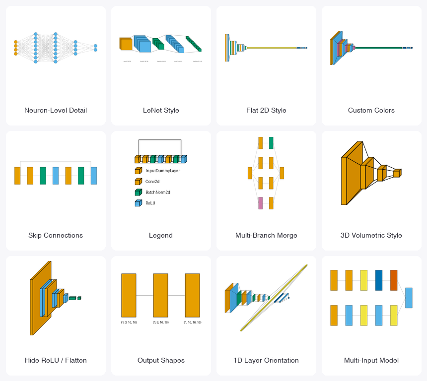

<div align="center">
 <h1>🔥 VisualTorch 🔥</h1>

[]() []() [](https://pepy.tech/project/visualtorch) [](https://github.com/willyfh/visualtorch/actions/workflows/pytest.yml) [](https://visualtorch.readthedocs.io/en/latest/?badge=latest)

</div>

**VisualTorch** aims to help visualize Torch-based neural network architectures. It currently supports generating flow-style, graph-style, and LeNet-style architectures for PyTorch Sequential and Custom models. This tool is adapted from [visualkeras](https://github.com/paulgavrikov/visualkeras), [pytorchviz](https://github.com/szagoruyko/pytorchviz), and [pytorch-summary](https://github.com/sksq96/pytorch-summary).

**Note:** `1.0.0` is a major release with breaking API changes, but with significantly better features and algorithms - upgrading is recommended. For the old API, use `0.2.5` or older.

**Limitation:** VisualTorch traces a real forward pass to build the diagram, which has two inherent
limitations shared by any tracing-based approach (not bugs, and not fixable without full symbolic
execution): (1) models with **data-dependent control flow** (e.g. a branch only taken if a tensor
value crosses some threshold) only show whichever branch the traced dummy input happened to take;
(2) a layer that returns **multiple meaningful output tensors** (e.g. a custom multi-task head)
only has its first tensor's shape reflected in that node's size/label - its downstream connections
are still correct either way. Contributions are welcome!

<div align="center">



</div>

## Documentation

Online documentation is available at [visualtorch.readthedocs.io](https://visualtorch.readthedocs.io/en/latest/).

The docs include [usage examples](https://visualtorch.readthedocs.io/en/latest/usage_examples/index.html), [API references](https://visualtorch.readthedocs.io/en/latest/markdown/api_references/index.html), and other useful information.

## Installation

See the [Installation page](https://visualtorch.readthedocs.io/en/latest/markdown/get_started/installation.html).

## Used in Research

VisualTorch has been used in published research, including works published in Nature, IEEE, and MDPI.

👉 See the full Research Showcase: https://visualtorch.readthedocs.io/en/latest/markdown/showcase/index.html

## Examples

See the [Usage Examples page](https://visualtorch.readthedocs.io/en/latest/usage_examples/index.html).

## Contributing

Please feel free to send a pull request to contribute to this project by following this [guideline](https://github.com/willyfh/visualtorch/blob/main/CONTRIBUTING.md).

## License

This poject is available as open source under the terms of the [MIT License](https://github.com/willyfh/visualtorch/blob/main/LICENSE).

Originally, this project was based on the [visualkeras](https://github.com/paulgavrikov/visualkeras) (under the MIT license), with additional modifications inspired by [pytorchviz](https://github.com/szagoruyko/pytorchviz), and [pytorch-summary](https://github.com/sksq96/pytorch-summary), both of which are also licensed under the MIT license.

## Citation

Please cite this project in your publications if it helps your research.

**Note:** the paper below describes the API as of its publication date (2024). VisualTorch has
since had breaking API changes (see the [documentation](https://visualtorch.readthedocs.io/en/latest/)
for the current API) - the DOI always resolves to what was actually reviewed and published, so
it isn't updated to match.

```bibtex
@article{Hendria2024,
  doi = {10.21105/joss.06678},
  url = {https://doi.org/10.21105/joss.06678},
  year = {2024},
  publisher = {The Open Journal},
  volume = {9},
  number = {102},
  pages = {6678},
  author = {Willy Fitra Hendria and Paul Gavrikov},
  title = {VisualTorch: Streamlining Visualization for PyTorch Neural Network Architectures},
  journal = {Journal of Open Source Software}
}
```
