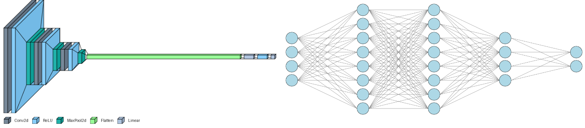

# VisualTorch Documentation

VisualTorch aims to help visualize Torch-based neural network architectures. It currently supports generating layered-style and graph-style architectures for PyTorch Sequential and Custom models.



## {octicon}`rocket` Get Started

::::{grid}

:::{grid-item-card} Installation
:link: markdown/get_started/installation
:link-type: doc

Installing visualtorch via PyPI or Source.
:::

::::

## {octicon}`eye` Usage Examples

::::{grid}

:::{grid-item-card} All Examples
:link: usage_examples/index
:link-type: doc

Usage examples of VisualTorch.
:::

::::

## {octicon}`code-square` Module References

::::{grid}

:::{grid-item-card} Layered View
:link: markdown/module_references/layered
:link-type: doc

Module references for layered view.
:::

:::{grid-item-card} Graph View
:link: markdown/module_references/graph
:link-type: doc

Module references for graph view.
:::

::::

## {octicon}`book` Citation

Please cite this project in your publications if it helps your research as follows:

```{literalinclude} snippets/citation/bib.txt
:language: bibtex
```

```{toctree}
:caption: Get Started
:hidden:

markdown/get_started/installation
```

```{toctree}
:caption: Usage Examples
:hidden:

usage_examples/layered/index
usage_examples/graph/index
```

```{toctree}
:caption: Module References
:hidden:

markdown/module_references/layered
markdown/module_references/graph
```

```{toctree}
:caption: Developer Guides
:hidden:

markdown/developer_guides/contributing
```

```{toctree}
:caption: License
:hidden:

markdown/license/index
```
