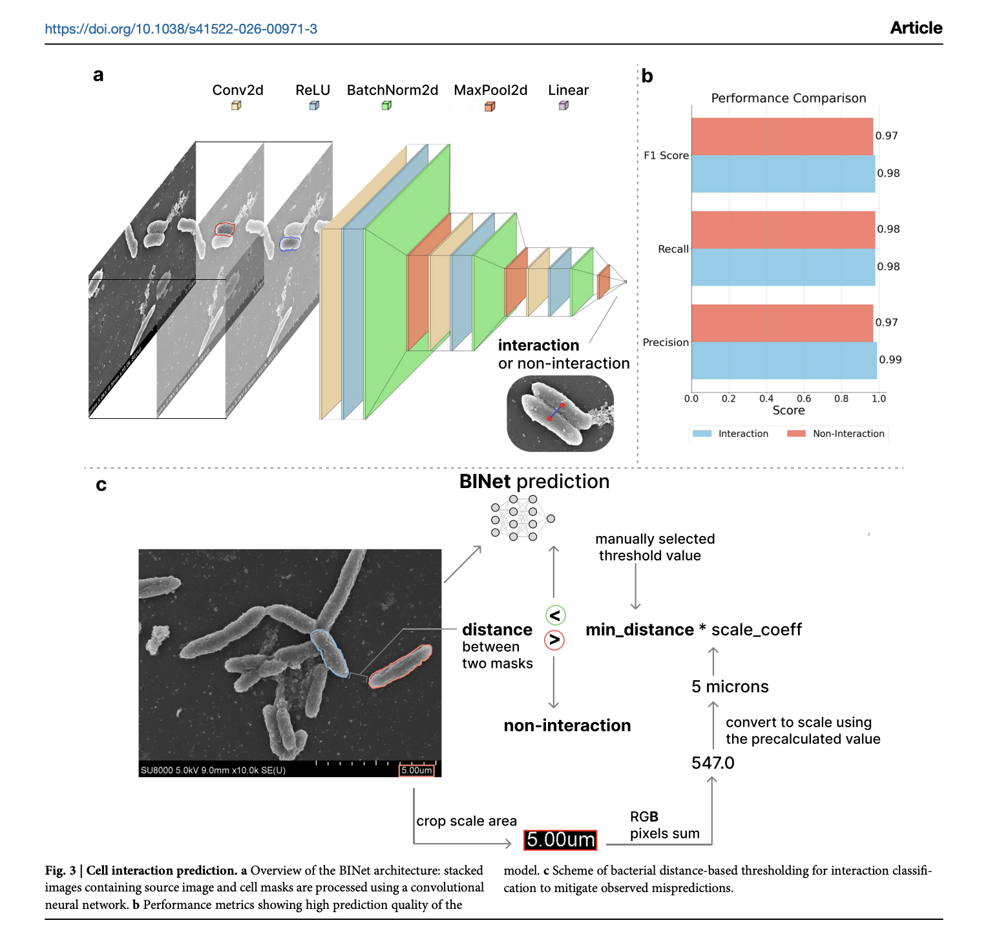
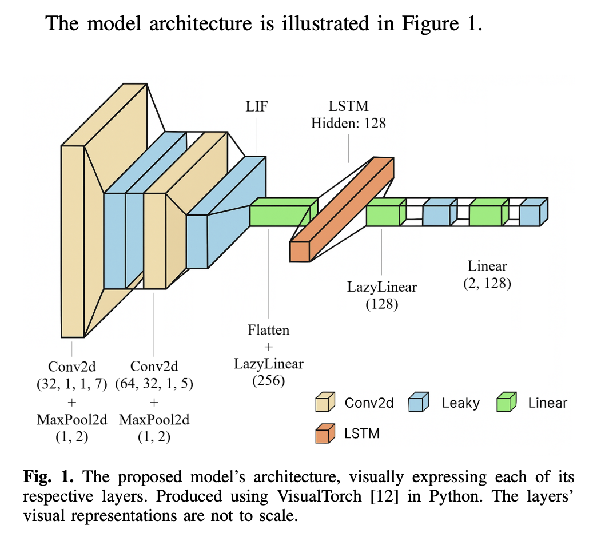
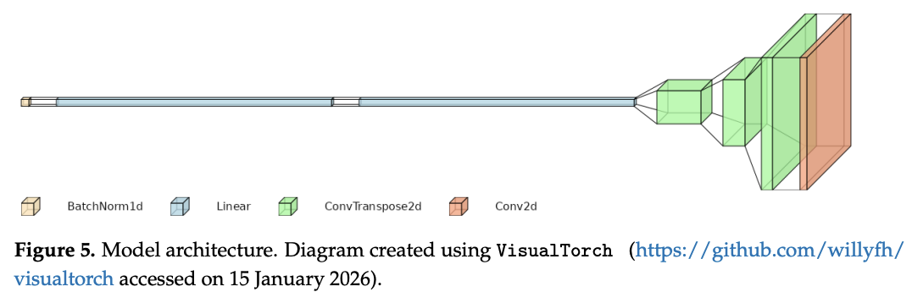
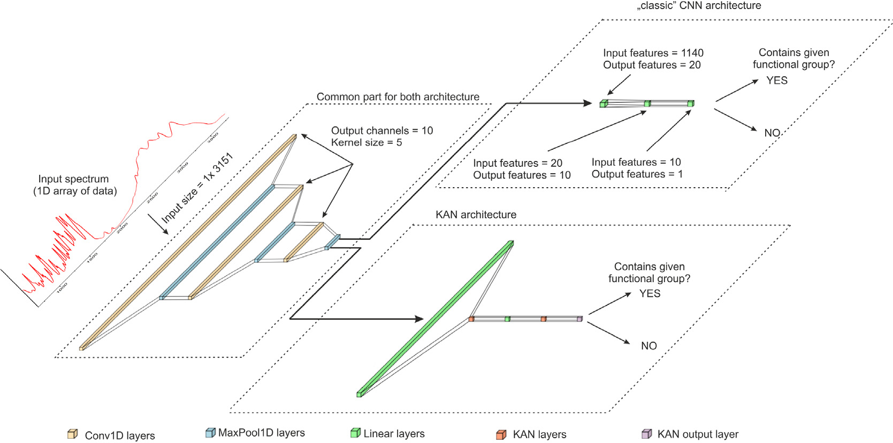

# Papers Using VisualTorch

Published research that has used VisualTorch to visualize model architectures. Used it in your own research, or know of a paper that cites it - even if it's not yours? [Open a pull request](https://github.com/willyfh/visualtorch/pulls) to add it here, or [tell us about it](https://github.com/willyfh/visualtorch/discussions) and we'll add it for you.

| Paper                                                                                                                                                                                                                                                                                     | Venue (Year)                        |
| ----------------------------------------------------------------------------------------------------------------------------------------------------------------------------------------------------------------------------------------------------------------------------------------- | ----------------------------------- |
| [Deep learning-based high-information-content graph representation of early stage bacterial biofilms](#deep-learning-based-high-information-content-graph-representation-of-early-stage-bacterial-biofilms)                                                                               | npj Biofilms and Microbiomes (2026) |
| [Energy-Efficient Epileptic Seizure Prediction Using Spiking Neural Networks](#energy-efficient-epileptic-seizure-prediction-using-spiking-neural-networks)                                                                                                                               | IEEE ISCAS (2026)                   |
| [Failure Evaluation of Steel Plate Shear Walls in Multi-Storey Steel Buildings Under Seismic Excitation Using Convolutional Neural Networks](#failure-evaluation-of-steel-plate-shear-walls-in-multi-storey-steel-buildings-under-seismic-excitation-using-convolutional-neural-networks) | Materials, MDPI (2026)              |
| [Kolmogorov–Arnold neural network for identification of functional groups from FTIR spectra](#kolmogorovarnold-neural-network-for-identification-of-functional-groups-from-ftir-spectra)                                                                                                  | Chemometrics and Intelligent Laboratory Systems (2025) |

---

## Deep learning-based high-information-content graph representation of early stage bacterial biofilms

**Authors:** Nersesyan, L. E., Boiko, D. A., Kurbanalieva, S., Dzhemileva, L. U., Kozlov, K. S., Ananikov, V. P. (2026)
**Venue:** _npj Biofilms and Microbiomes_
**Link:** [https://www.nature.com/articles/s41522-026-00971-3](https://www.nature.com/articles/s41522-026-00971-3)

Models early-stage bacterial biofilms as interaction graphs (cells as vertices, predicted
intercellular interactions as edges), combining Mask R-CNN for cell segmentation with a custom
network (BINet) for interaction prediction - enabling classification of developmental stage and
substrate type from image-derived graph features.

---

## Energy-Efficient Epileptic Seizure Prediction Using Spiking Neural Networks

**Authors:** Brady, A., Moore-Hill, D., Khan, F., Daoud, H. (2026)
**Venue:** IEEE International Symposium on Circuits and Systems (ISCAS)
**Link:** [https://ieeexplore.ieee.org/document/11562867](https://ieeexplore.ieee.org/document/11562867)

A patient-specific model, trained on the CHB-MIT scalp EEG dataset, that combines convolutional
layers with Leaky Integrate-and-Fire spiking neurons and a recurrent network to detect pre-ictal
(pre-seizure) brain states - the low energy consumption of spiking neurons targets
power-constrained, on-device seizure prediction for wearable/IoT devices.

---

## Failure Evaluation of Steel Plate Shear Walls in Multi-Storey Steel Buildings Under Seismic Excitation Using Convolutional Neural Networks

**Authors:** Bonfini, P., Schetakis, N., Sukhnandan, J., Drosopoulos, G. A., Stavroulakis, G. E. (2026)
**Venue:** _Materials_ (MDPI)
**Link:** [https://www.mdpi.com/1996-1944/19/5/878](https://www.mdpi.com/1996-1944/19/5/878)

Trains a CNN on physics-based finite element simulations to predict equivalent plastic strain
(failure distribution) on steel plate shear walls from building geometry and seismic intensity,
for use in structural digital twins.

---

## Kolmogorov–Arnold neural network for identification of functional groups from FTIR spectra

**Authors:** Urbańczyk, T., Bożek, J., Mirczak, S., Koperski, J., Krośnicki, M. (2025)
**Venue:** _Chemometrics and Intelligent Laboratory Systems_
**Link:** [https://www.sciencedirect.com/science/article/pii/S0169743925001066](https://www.sciencedirect.com/science/article/pii/S0169743925001066)

Trains separate binary classifiers to identify 22 molecular functional groups from one-dimensional
FTIR spectra. The study compares a classic CNN ending in fully connected linear layers with a
CNN-KAN that replaces those final layers with Kolmogorov–Arnold layers, while both architectures
share the same convolutional feature extractor.

