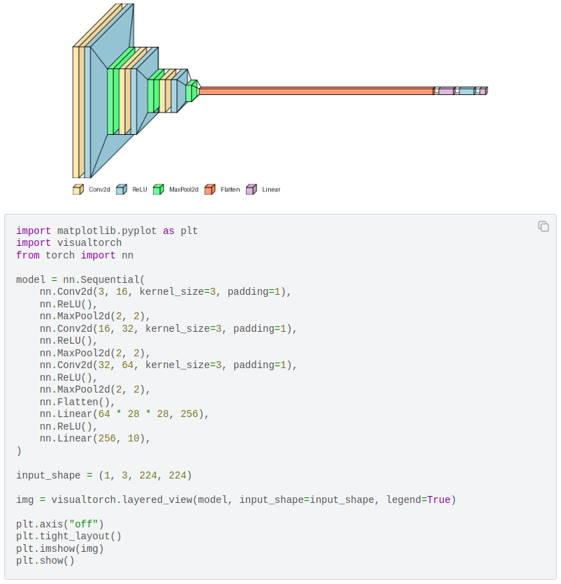

# Summary

VisualTorch is a library designed for visualizing neural network architectures in PyTorch. It offers support for multiple visualization styles, such as layered-style, graph-style, and the newly added LeNet-like visualization. When provided with a sequential or custom PyTorch model, alongside the input shape and visualization specifications, VisualTorch automatically translates the model structure into an architectural diagram. The resulting diagram can be refined using various configurations, including style, color, opacity, size, and a legend. VisualTorch is particularly valuable for projects involving PyTorch-based neural networks. By facilitating the generation of graphics with a single function call, it streamlines the process of visualizing neural network architectures. This ensures that the produced results are suitable for publication with minimal additional modifications. Moreover, owing to its diverse customization options, VisualTorch empowers users to generate polished figures suitable for publication.

# Statement of Need

Neural network architecture visualization plays an important role in the scientific process within the realm of artificial intelligence and machine learning. While mathematical equations and descriptive paragraphs provide detailed information about architectures, effective visualizations can significantly aid scientists in communicating their proposed architectures to others.

In deep learning projects based on Keras [@Chollet:2015], the visualkeras project [@Gavrikov:2020] has been gaining traction over nearly four years of development. It offers visualization of Keras-based neural network architectures in two styles: layered and graph. The visualtorch library provides visualization for PyTorch-based architectures [@Paszke:2019]. PyTorch itself has gained popularity among deep learning frameworks within the scientific community in recent years [@Aoun:2022]. VisualTorch expands the functionality of VisualKeras to PyTorch and offers more visualization styles, improved usability, and a development environment by providing web-based documentation and CI/CD pipelines for seamless future contributions and collaborations.

# Introduction

Recent advancements in artificial intelligence have sparked widespread interest among researchers, particularly in exploring innovative algorithmic approaches such as neural networks or deep learning architectures. These architectures have demonstrated remarkable utility across various AI applications, including computer vision, natural language processing, and robotics. To implement neural network architectures, many researchers and practitioners often utilize established deep learning frameworks, such as PyTorch [@Paszke:2019], TensorFlow [@Abadi:2016], and Keras [@Chollet:2015]

To effectively communicate their ideas, practitioners often employ architecture diagrams as aids for comprehension. While detailed mathematical descriptions help in understanding the intricacies of algorithms, visual representations of architectures offer an additional means of conveying concepts, enabling individuals to grasp the overall visual representation. VisualTorch is designed to facilitate the visualization of PyTorch-based neural network architectures. Instead of manually constructing diagrams from scratch, practitioners can simply leverage our library to generate visualizations. With a variety of customization options, users can tailor visualizations to suit their preferences.

One of the important features of VisualTorch is its ability to automatically map a neural network model to visualizations using various styles such as layered, graph, and LeNet-like visualization [@Lecun:1998]. Users can further refine these visualizations by adjusting attributes such as color, opacity, and size. VisualTorch aims to offer a solution for rapidly visualizing a wide range of neural network architectures in PyTorch. Inspired by the visualkeras [@Gavrikov:2020] project, our VisualTorch library shares a similar motivation: to assist in visualizing neural network architectures. Unlike visualkeras, our library offers enhanced functionality specifically tailored for PyTorch-based architectures, supporting models defined with `torch.nn.Module` and `torch.nn.Sequential`. In addition to providing more visualization styles, including the recent addition of LeNet style, our library also provides online web-based documentation and streamlined CI/CD workflows, which improve usability and facilitate future development.

# Usage Example

In this section, we provide a usage example for each of the layered, LeNet, and graph-style visualizations. The graphic visualizations, displayed using the Matplotlib library [@Hunter:2007], are shown in \autoref{fig:layered}, \autoref{fig:lenet}, and \autoref{fig:graph}.

## Layered Style

```python
import matplotlib.pyplot as plt
import visualtorch
from torch import nn

model = nn.Sequential(
    nn.Conv2d(3, 16, kernel_size=3, padding=1),
    nn.ReLU(),
    nn.MaxPool2d(2, 2),
    nn.Conv2d(16, 32, kernel_size=3, padding=1),
    nn.ReLU(),
    nn.MaxPool2d(2, 2),
    nn.Conv2d(32, 64, kernel_size=3, padding=1),
    nn.ReLU(),
    nn.MaxPool2d(2, 2),
    nn.Flatten(),
    nn.Linear(64 * 28 * 28, 256),
    nn.ReLU(),
    nn.Linear(256, 10),
)

input_shape = (1, 3, 224, 224)

img = visualtorch.layered_view(model, input_shape=input_shape, legend=True)

plt.axis("off")
plt.tight_layout()
plt.imshow(img)
plt.show()
```

{ width=80% }

## LeNet Style

```python
import matplotlib.pyplot as plt
import visualtorch
from torch import nn

model = nn.Sequential(
    nn.Conv2d(3, 8, kernel_size=3, padding=1),
    nn.MaxPool2d(2, 2),
    nn.Conv2d(8, 16, kernel_size=3, padding=1),
    nn.MaxPool2d(2, 2),
)

input_shape = (1, 3, 128, 128)

img = visualtorch.lenet_view(model, input_shape=input_shape)

plt.axis("off")
plt.tight_layout()
plt.imshow(img)
plt.show()
```

{ width=80% }

## Graph Style

```python
import matplotlib.pyplot as plt
import torch
import visualtorch
from torch import nn

class SimpleDense(nn.Module):
    def __init__(self) -> None:
        super().__init__()
        self.h0 = nn.Linear(4, 8)
        self.h1 = nn.Linear(8, 8)
        self.h2 = nn.Linear(8, 4)
        self.out = nn.Linear(4, 2)

    def forward(self, x: torch.Tensor) -> torch.Tensor:
        x = self.h0(x)
        x = self.h1(x)
        x = self.h2(x)
        return self.out(x)

model = SimpleDense()

input_shape = (1, 4)

img = visualtorch.graph_view(model, input_shape)

plt.axis("off")
plt.tight_layout()
plt.imshow(img)
plt.show()
```

{ width=80% }

# Acknowledgements

We extend our appreciation to our community that we anticipate will contribute to the advancement of VisualTorch. Your future contributions, whether through questions, bug reports, or code submissions, will be instrumental in shaping the development of this project. Together, we look forward to fostering a collaborative environment that drives innovation and progress. Thank you for your anticipated dedication and commitment to excellence.

# References
